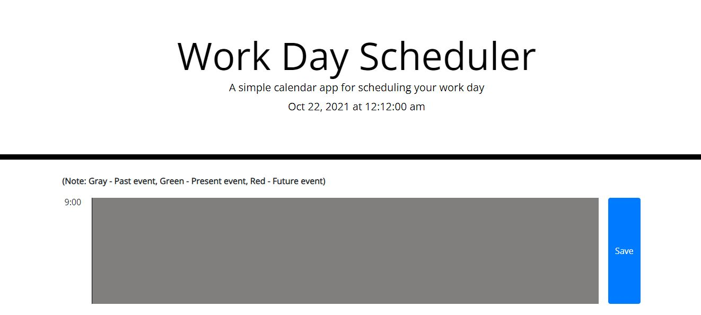
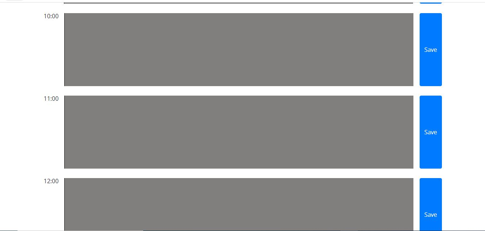
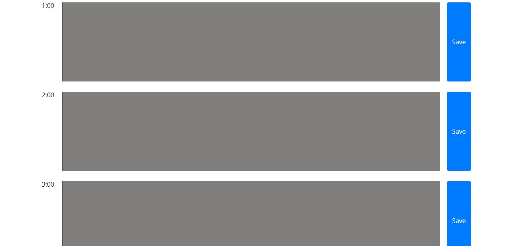
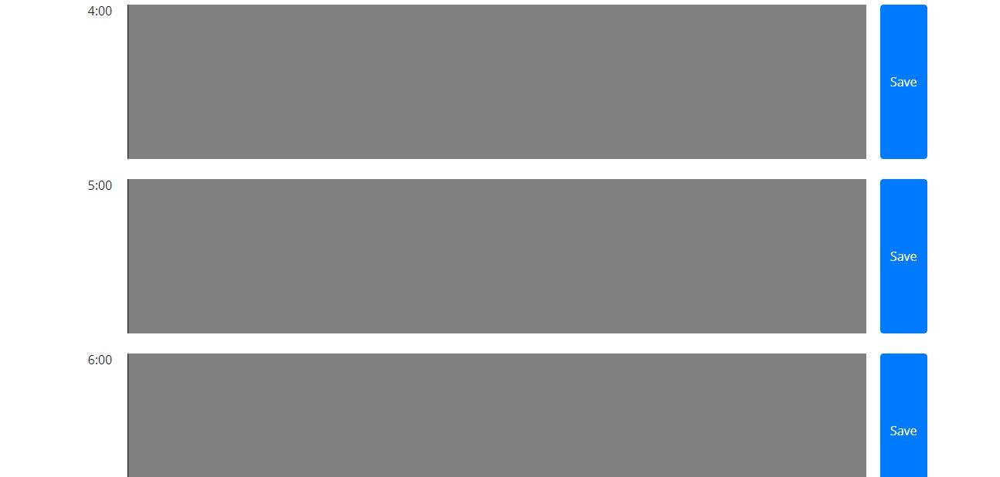

# day-planner

Link to deployed website: https://asharif123.github.io/day-planner/

Day Planner gives users the opportunity to add and save their daily tasks from 9 am to 6 pm.

The user is presented with 10 textboxes each having it's own timestamp from 9 am to 6 pm

The user clicks on a textbox, adds the task or event, and can save their daily task corresponding to each time by clicking on the save button.

The tasks that the user adds will stil be there even if the user refreshes. This is accomplished by using the Javascript local storage function.

The program was created using HTML/CSS for the frontend and all the backend logic was made possible using Javascript.

Here are 4 screenshots representing the entire Day Planner website.

1) The user will see the title of the webpage with the current date and time being updated every second. There are 10 events ranging from 9 am to 6 pm.

2) Each textbox is color coded to indicate it's either in the past event (gray), present event (green), or future event (red) depending on the timestamp associated with that textbox.

3) Example if it's currently 1 pm, the timestamps 9 am to 12 pm will be gray, 1 pm will be green, and timestamps 2 to 6 pm will be highlighted in red

4) Each textbox has a save button next to it so when the user enters information and clicks save, the information will be saved to that particular textbox.

